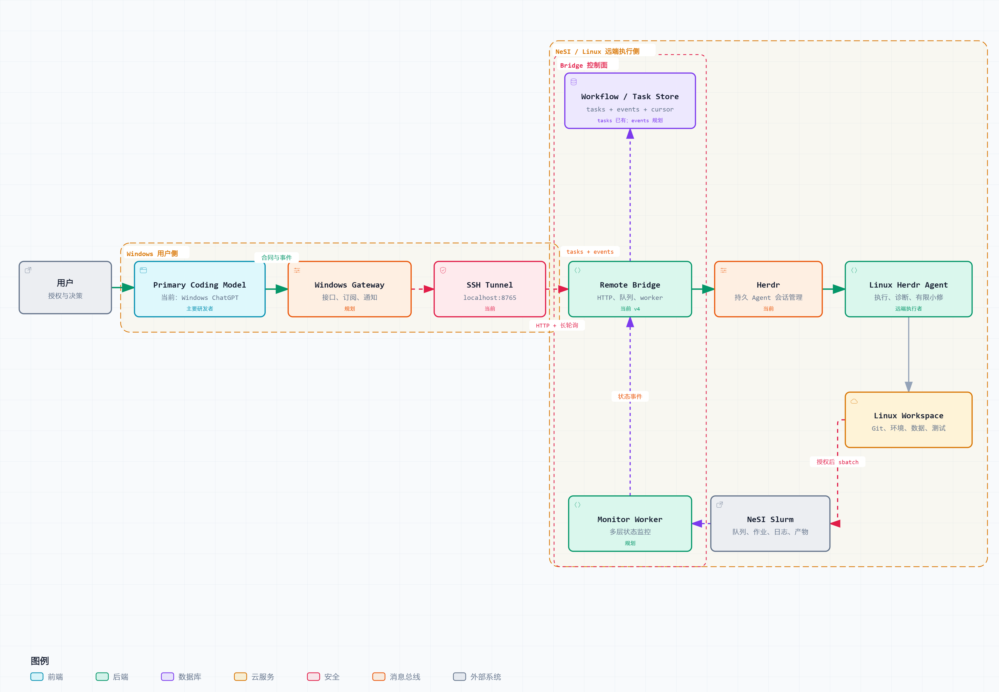
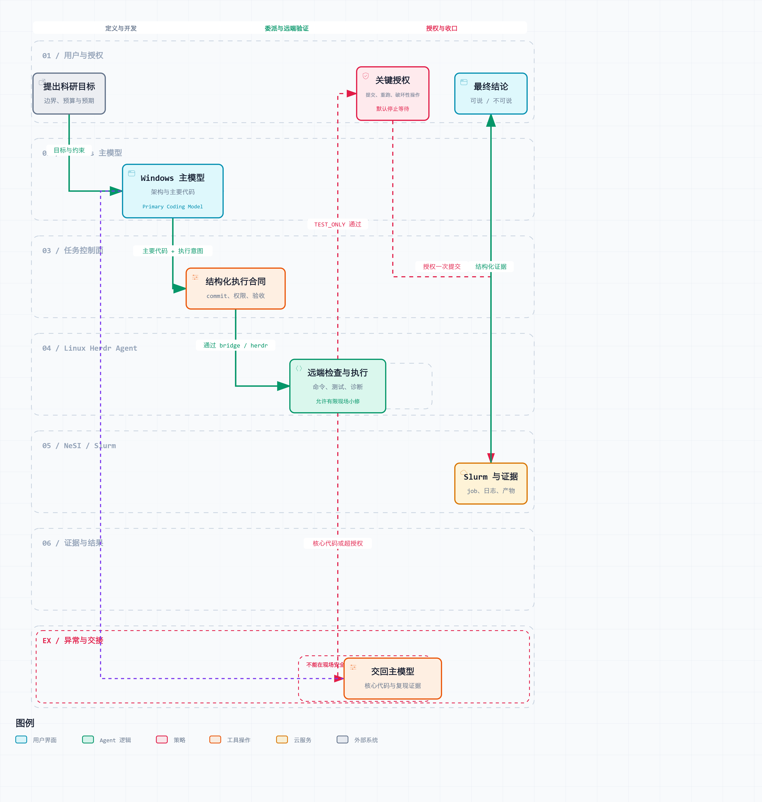

<div align="center">
  
</div>

# Herdr Task Bridge

[](https://github.com/Jiaofeisiling/herdr-task-bridge/actions/workflows/tests.yml)
[](LICENSE)

English | [简体中文](README.zh-CN.md)

`herdr-task-bridge` is an execution gateway for remote research computing. It lets you work entirely in ChatGPT, Claude, Cursor, or another AI development tool on Windows while the commands, verification, and Slurm work that need a Linux/NeSI environment are carried out by a persistent Herdr agent — without logging into the server for routine operations yourself.

v4 provides the Windows CLI, the HTTP bridge behind an SSH tunnel, the SQLite asynchronous task queue, multi-agent routing, mutual exclusion, and conservative recovery. The "Target architecture" below also covers the Windows Gateway, event stream, active notification, and dedicated monitoring worker that are **not yet implemented**; this document distinguishes what exists from what is planned.

## What this project is

This is not a thin wrapper around a remote shell, and not two AIs chatting freely. It connects roles with distinct, complementary responsibilities:

- **Windows primary coding model** — the main model you choose; typically ChatGPT on Windows today. It understands the research goal and owns architecture, algorithms, most of the code, cross-file refactoring, review, and PRs.
- **Linux Herdr agent (remote execution engineer)** — runs commands in the real Linux/NeSI environment, diagnoses environment problems, runs tests and minimal fixes, submits or monitors Slurm work within its authorisation, and returns structured evidence. It is not the default primary code author.
- **You (owner / approver)** — define goals, budget, and permission boundaries, choose the primary model, and make the final call on anything expensive, destructive, irreversible, or scientifically ambiguous.
- **Bridge / gateway (control plane)** — reliably delivers execution contracts, persists tasks and events, recovers connections, deduplicates, routes, and notifies. It makes neither the research decisions nor the Linux execution.

A workflow has exactly one primary coding model at a time. ChatGPT, Claude, and Cursor can each serve as the entry point or adapter, but they must not modify the same workspace concurrently without an explicit handover and branch isolation.

### Code ownership boundary

The Linux Herdr agent may independently write what genuinely belongs in the Linux environment: Bash/Slurm scripts, module/conda/CUDA environment glue, diagnostic scripts, and the minimal local fixes needed to get something passing in the real environment. The following stays with the Windows primary model by default: core algorithms, model architecture, data splits, evaluation protocol, public APIs, cross-module refactoring, and most business code.

Every execution contract should choose one coding policy:

| Mode | What the Linux Herdr agent may change |
|---|---|
| `no_code_changes` | Read-only inspection and execution; no code modification. |
| `environment_and_minimal_fix` | Default. Linux-specific glue plus the minimal fixes needed for verification. |
| `scoped_development` | A bounded piece of development within named files, branches, and acceptance criteria. |

Whichever mode applies, the single-writer rule holds: the Windows primary model and the Linux Herdr agent never edit the same file at the same time. Genuine parallel work uses separate Git branches or worktrees and hands over through commits/PRs.

## Target architecture

[](docs/diagrams/research-execution-architecture.html)

> Click the image for an interactive diagram with zoom, theme switching, and export.

The target architecture separates the control plane from the execution plane: the primary model produces execution contracts, the gateway/bridge handles reliable delivery and state, the Herdr agent executes in the real environment, and a monitor worker independently tracks long-running jobs. Monitoring should not occupy an execution agent for long stretches.

## End-to-end research workflow

[](docs/diagrams/research-execution-workflow.html)

> Click the image for an interactive diagram with zoom, theme switching, and export.

An execution contract should carry at least:

```yaml
objective: the research or engineering goal
project: project identifier
workdir: an explicit working directory on Linux
expected_git_commit: the expected baseline commit
allowed_actions: which reads, modifications, installs, submissions or cancellations are permitted
coding_policy: no_code_changes | environment_and_minimal_fix | scoped_development
slurm_policy: dry-run only, TEST_ONLY permitted, or a single authorised real submission
acceptance: machine-checkable acceptance conditions
reporting: which logs, artifacts, metrics, limitations and evidence to return
```

## Status and evidence boundaries

These layers must be reported separately. A single `done` must never stand in for all of them:

1. Whether the bridge service is reachable.
2. Whether the Herdr agent is `idle`, `working`, `done`, or in an error state.
3. Whether the bridge `task_id` is `queued`, `running`, `done`, `error`, or `orphaned`.
4. Whether the Slurm `job_id` is queued, running, completed, failed, or cancelled.
5. Whether logs, checkpoints, tables, and other artifacts exist and are complete.
6. Whether the metrics, sample counts, configuration, and evaluation protocol actually support a research conclusion.

Therefore: **a bridge task reaching `done` does not mean the Slurm job finished, and Slurm reporting `COMPLETED` does not mean the research result is valid.** `orphaned` only means the bridge lost reliable tracking; the remote action may still be running. Inspect the real effects before doing anything else, and never blindly retry.

Active reporting should use a durable event stream rather than having the Windows side poll a wall of terminal text. The intended design has the remote side write `task_events` transactionally while a Windows gateway uses a cursor-based long poll or subscription: silent while nothing changes, and notifying on `needs_input`, `error`, `orphaned`, completion, or a new artifact. The correlation identifiers are:

```text
workflow_id → task_id → command_run_id → slurm_job_id → artifact_id
                                      ↘ event_seq
```

## When "main development" can be called complete

Not yet. Below is the acceptance checklist from v4 to that point. Only once every blocking item is done **and** verified end to end against a real NeSI environment does this move into a maintenance-and-extension phase.

### Already in place

- [x] Windows PowerShell CLI and HTTP bridge.
- [x] Persistent SQLite tasks, asynchronous delegation, conservative `orphaned` marking after a restart.
- [x] Multi-agent discovery, explicit routing, and per-agent mutual exclusion.
- [x] Synchronous/asynchronous execution, queue depth limits, timeouts, and basic token authentication.
- [x] Bridge supervisor, deployment aliases, and a pytest/Pester/CI baseline.
- [x] Documentation of roles, code ownership, target architecture, workflow, and evidence boundaries.
- [x] **Reliable result extraction** — agents deliver results through a per-task file rather than scraped terminal text, so a backend's terminal rendering (Claude Code vs OpenCode) no longer determines whether a result can be read at all.

### Blocking items for main development

- [ ] **Workflow and execution contracts** — add `workflow_id`, an execution-contract schema, originating client, permission/coding policy, idempotency keys, and correlation IDs.
- [ ] **Durable event stream** — transactional `task_events`, a monotonic `event_seq`, a cursor/long-poll API, and no missed or duplicated reports across reconnects.
- [ ] **Windows Gateway** — lift the shared client, SSH tunnel lifecycle, reconnection, subscriptions, and ChatGPT/Claude/Cursor adapters out of a single-shot CLI.
- [ ] **Active notification** — notify only on completion, failure, an authorisation request, `orphaned`, or important new evidence; deduplicate, stay quiet while nothing changes, and stop automatically at a terminal state.
- [ ] **Independent monitoring worker** — track bridge tasks, Herdr agents, Slurm jobs, and artifacts separately without occupying an execution agent.
- [ ] **Slurm safety gate** — built-in static check → dry run → `TEST_ONLY` → a single authorised real submission; record job IDs and never auto-resubmit from an unknown state.
- [ ] **Structured remote reporting** — support progress, `needs_input`, artifact, metric, warning, and final report rather than relying on terminal text extraction.
- [ ] **Controlled concurrency and write isolation** — execute asynchronous tasks concurrently per agent, with single-writer or branch/worktree isolation and explicit handover for writes to the same project.
- [ ] **Secure defaults** — token authentication on by default for production deployments, plus secret management, command/directory allowlists, per-task permissions, and audit records.
- [ ] **Reproducible evidence bundle** — a final report that always carries the commit, workdir, commands, environment, job/task IDs, log and artifact paths, metric configuration, sample counts, and what may and may not be claimed.
- [ ] **Real end-to-end acceptance** — covering normal execution, bridge restart, tunnel interruption, duplicate requests, timeout/`orphaned`, authorisation pauses, Slurm success and failure, and notification recovery.
- [ ] **Release readiness** — install/upgrade/uninstall documentation, compatibility notes, migration scripts, and a stable release/tag verified on real NeSI.

### Extensions that do not block main development

- Web dashboard, mobile notifications, and further UI.
- Schedulers beyond Slurm, or cloud compute backends.
- Large file transfer, online artifact preview, and integration with long-term experiment tracking platforms.
- More primary-model adapters and cross-host federated scheduling.

## Current v4 implementation


```
Windows PowerShell client (sentinel.ps1)
        │ HTTP over a private connection or SSH port forward
        ▼
bridge.py on a Linux host (ThreadingHTTPServer + SQLite)
        │ herdr CLI
        ▼
Persistent Herdr-managed agent session(s)
```

The service has two execution modes:

- **Synchronous** — `/ask` and `/prompt` hold the selected agent's lock and keep the request open until the agent finishes.
- **Asynchronous** — `/delegate` stores a task in SQLite and returns a `task_id` immediately. A background worker executes queued tasks and exposes their state through `/tasks/<id>`.

Locks are **per agent**, so work directed to different agents is isolated. The asynchronous worker itself is intentionally single-threaded; this release does not promise parallel execution of queued tasks across agents. `/health` is independent of Herdr and SQLite, so it answers whether the bridge process is alive even when agents or tasks are busy.

## Quick start

This example assumes that a private connection from Windows to the remote bridge already exists (for example, a VS Code Remote-SSH local port forward to `127.0.0.1:8765`). Run it from the repository root:

```powershell
.\sentinel.ps1 health
.\sentinel.ps1 ready

$id = (.\sentinel.ps1 delegate "summarize the current directory; do not modify files" | ConvertFrom-Json).task_id
.\sentinel.ps1 wait $id
```

If the host has more than one Herdr agent, inspect them and select one explicitly:

```powershell
.\sentinel.ps1 agents
.\sentinel.ps1 ask -Agent "your-agent-name" "check disk usage"
```

## Command reference

| Command | HTTP | Endpoint | Purpose |
|---|---|---|---|
| `health` | GET | `/health` | Process liveness only; does not contact Herdr or SQLite. |
| `agents` | GET | `/agents` | Lists Herdr-managed agents and their status. |
| `ready` | GET | `/ready` | Reports whether the selected agent can accept work (`idle` or `done`). |
| `status` | GET | `/status` | Returns the raw `herdr agent get` response. |
| `read` | GET | `/read` | Reads recent agent-terminal lines for diagnosis. |
| `quota` | GET | `/quota` | Lists agents temporarily blocked after a provider quota or balance failure. |
| `quota-reset` | POST | `/quota/reset` | Clears one agent's quota circuit with `-Agent`, or all circuits when deliberately called without it. |
| `delegate <task>` | POST | `/delegate` | Queues a task and returns a `task_id`; default server timeout is six hours. |
| `task <task_id>` | GET | `/tasks/<id>` | Gets task state: `queued`, `running`, `done`, `error`, `orphaned`, or `quota_exhausted`. |
| `wait <task_id>` | GET | `/tasks/<id>` | Polls every three seconds until a terminal state, then prints the result or error. |
| `tasks` | GET | `/tasks` | Lists the 20 most recent tasks. |
| `ask <task>` | POST | `/ask` | Runs synchronously and returns the agent result; returns `409` if that agent is busy. |
| `prompt <task>` | POST | `/prompt` | Runs synchronously but does not extract a result. |

Common client options are `-Agent <name>`, `-TimeoutMs <milliseconds>` (for `ask`, `prompt`, and `delegate`), and `-Lines <count>` (for `read`). Agent names are trimmed, must be non-empty, and are limited to 200 characters. Request timeouts must be between 1 second and 6 hours.

## Task lifecycle and results

```
queued → running → done
              ↓        ↑ (one result-file reminder)
    error / orphaned / quota_exhausted
```

- `orphaned` means the bridge lost the completion signal, not that the remote task necessarily failed. Do **not** blindly retry it; inspect the task's real effects first.
- `error` means the bridge confirmed an execution or result-collection failure.
- `quota_exhausted` means every eligible fallback was also quota-blocked or reported a quota/balance failure. The task was not retried after that result.
- On restart, a task that was `running` becomes `orphaned`. The bridge never reruns it automatically.

Agents return results by writing one file per task under `SENTINEL_RESULT_DIR`; the bridge reads and removes the file. This avoids terminal scraping, truncation, UI noise, and coupling to an agent's terminal format. If the file is missing after an agent finishes, the bridge sends one narrowly scoped reminder to write the result file only. A second failure is reported as `error` with terminal output retained for diagnosis.

The result directory must be writable by both the bridge process and the selected agent. Grant only that narrow write permission; do not weaken an agent's general approval policy merely to collect results.

### Active quota failover

The bridge recognises common provider signals such as Claude 5-hour/weekly usage limits, HTTP `429`, OpenCode API `402`, and insufficient API credit or balance. On detection it opens a durable circuit for the failed agent, skips the otherwise normal result-file reminder, and actively tries an eligible alternate agent.

With automatic discovery, an alternate must be a **different runtime family** (for example, Claude ↔ OpenCode) so the bridge does not simply move to another session that may share the same exhausted account. Set `SENTINEL_QUOTA_FAILOVER_AGENTS` to an ordered, explicit allowlist when your deployment has known independent fallback accounts. An unavailable fallback leaves asynchronous work queued for another attempt; only exhausted eligible fallbacks produce `quota_exhausted`.

After a provider's reset or an account recharge, verify the account outside the bridge and clear its circuit deliberately:

```powershell
sentinel quota
sentinel quota-reset -Agent "your-agent-name"
```

Do not clear a circuit merely because an agent is `idle`: provider limits can leave an agent idle while its account remains unavailable.

## Configuration and security

The remote service reads the following environment variables:

| Variable | Default | Meaning |
|---|---|---|
| `SENTINEL_BRIDGE_PORT` | `8765` | Listening port. |
| `HERDR_BIN` | `herdr` | Path to the Herdr executable. |
| `SENTINEL_AGENT` | `sentinel` | Default target agent when none is specified. |
| `SENTINEL_DB` | `~/sentinel-bridge/tasks.db` | SQLite task-queue path. |
| `SENTINEL_RESULT_DIR` | System temp directory / `sentinel-bridge-results` | Shared directory for agent result files. |
| `SENTINEL_BRIDGE_TOKEN` | unset | Optional shared-secret authentication token. |
| `SENTINEL_MAX_QUEUE_DEPTH` | `50` | Maximum number of queued asynchronous tasks. |
| `SENTINEL_QUOTA_FAILOVER_AGENTS` | unset | Comma-separated, ordered fallback-agent allowlist after a quota failure. |

Copy [`remote/bridge.env.example`](remote/bridge.env.example) to the untracked `remote/bridge.env` for deployment-specific values. Never commit real hostnames, project identifiers, paths, usernames, prompts, or tokens; see [CONTRIBUTING.md](CONTRIBUTING.md) for the project's sensitive-data rules.

Authentication is disabled until `SENTINEL_BRIDGE_TOKEN` is set on both the Linux service and Windows client. Use an ASCII-only, high-entropy token and protect the network path as well. `/health` intentionally remains unauthenticated so it can be used for simple liveness probes.

## Reference deployment: NeSI

The maintained deployment uses a Git clone on a Linux host reachable from NeSI, a `screen` session, and the restart loop in [`remote/bridge-supervisor.sh`](remote/bridge-supervisor.sh). The helper functions in [`remote/bridge-aliases.sh`](remote/bridge-aliases.sh) are the authoritative implementation of the reference update flow:

```bash
echo 'source ~/herdr-task-bridge/remote/bridge-aliases.sh' >> ~/.bashrc
source ~/.bashrc

bridge-deploy    # pull and restart
bridge-status    # inspect screen, process, health, and logs
```

The supervisor preserves a `screen` session and logs restarts to `sentinel-bridge/bridge.log`; do not run `bridge.py` directly in `screen`. For another HPC system or Linux server, adapt only the deployment details (clone location, service supervisor, private connectivity, environment file, and agent permissions). The bridge API and its safety contract remain the same.

On Windows, optionally load [`sentinel.profile.ps1`](sentinel.profile.ps1) from your PowerShell profile to use `sentinel` from any directory:

```powershell
. "E:\herdr-task-bridge\sentinel.profile.ps1"
sentinel health
sentinel ask "check disk usage"
```

## Development and verification

The remote runtime uses only the Python standard library. The test dependency is local to development:

```bash
cd sentinel-bridge
python -m venv .venv
.venv/Scripts/python.exe -m pip install pytest  # Windows
.venv/bin/python -m pip install pytest          # Linux/macOS
.venv/Scripts/python.exe -m pytest test_bridge.py -v
```

The Python suite has 111 mocked tests and does not require a real Herdr installation or network. The Windows client has a 16-test Pester suite that runs against a local HTTP stub:

```powershell
Install-Module -Name Pester -RequiredVersion 5.6.1 -Scope CurrentUser  # first time only
Invoke-Pester -Path .\sentinel.Tests.ps1 -Output Detailed
```

CI runs Python tests and the Pester suite under both Windows PowerShell 5.1 and PowerShell Core. Unit tests do not replace a carefully scoped live verification in your own environment.

## Contributing and design history

Read [CONTRIBUTING.md](CONTRIBUTING.md) before opening a pull request, especially its rules for preventing institutional or research data from entering Git history. The detailed design and implementation history is in [docs/superpowers/plans/2026-08-30-sentinel-bridge-v2.2-v2.3.md](docs/superpowers/plans/2026-08-30-sentinel-bridge-v2.2-v2.3.md).

Licensed under the [MIT License](LICENSE).
