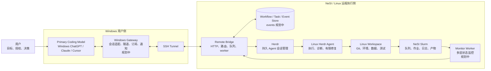
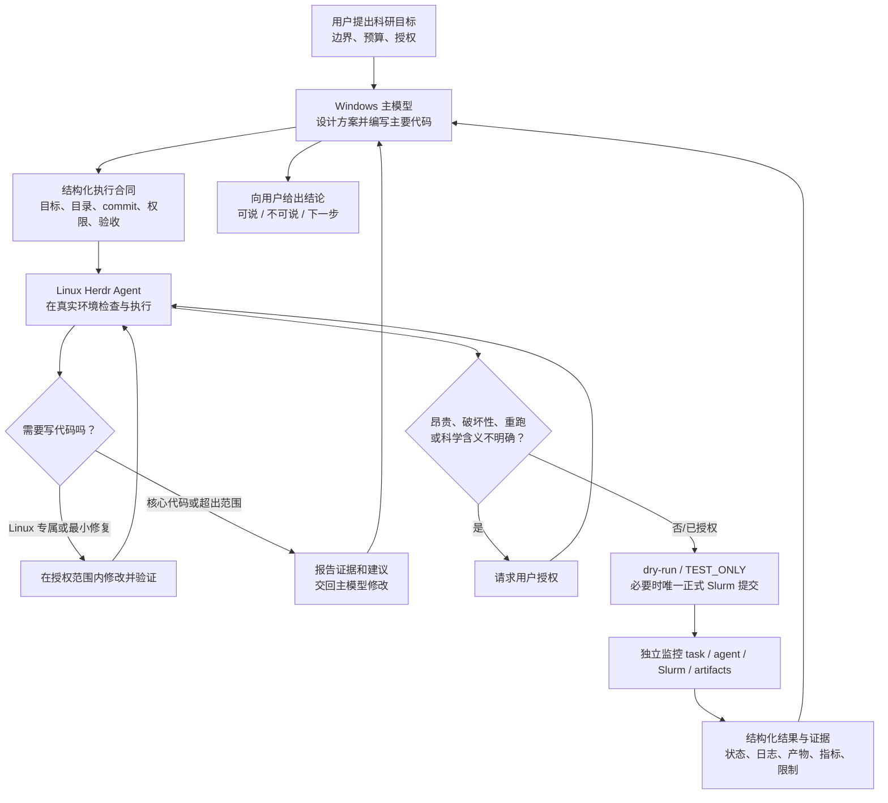

<div align="center">
  
</div>

# NeSI Sentinel Bridge (herdr-task-bridge)

[](https://github.com/Jiaofeisiling/herdr-task-bridge/actions/workflows/tests.yml)
[](LICENSE)

`herdr-task-bridge` 是面向远程科研计算的执行网关。它让用户只需操作 Windows 上的 ChatGPT、Claude、Cursor 或其他智能开发工具，就能把需要 Linux/NeSI 环境的命令、验证和 Slurm 工作交给持久运行的 Herdr agent，不必亲自登录服务器处理日常操作。

当前 v4 已提供 Windows CLI、SSH 隧道后的 HTTP bridge、SQLite 异步任务队列、多 Herdr agent 路由、互斥保护与保守恢复。下面的“目标架构”还包括尚待实现的 Windows Gateway、事件流、主动通知和专用监控 worker；文档会明确区分现状与规划。

## 项目定位

本项目不是“远程 shell 的薄包装”，也不是让两个 AI 随意对话。它连接的是两个职责不同、能力互补的角色：

- **Windows 主模型（Primary Coding Model）**：用户选定的主要智能模型；当前典型实例是 Windows 上的 ChatGPT。它理解科研目标，负责架构、算法、绝大部分代码、跨文件重构、代码审查与 PR。
- **Linux Herdr Agent（Remote Execution Engineer）**：远程执行工程师。它在真实 Linux/NeSI 环境中运行命令、诊断环境问题、做测试与最小修复、按授权提交或监控 Slurm，并返回结构化证据；它不是默认的主要代码作者。
- **用户（Owner / Approver）**：定义目标、预算和权限边界，选择主模型，并对昂贵、破坏性、不可逆或科学含义不明确的动作作最终决定。
- **Bridge / Gateway（Control Plane）**：可靠传递执行合同、保存任务与事件、恢复连接、去重、路由和通知；它不替代主模型作科研决策，也不替代 Herdr agent 执行 Linux 工作。

同一个 workflow 在同一时刻只设一个 Primary Coding Model。ChatGPT、Claude、Cursor 都可以作为入口或适配器，但不能在没有交接和分支隔离的情况下同时修改同一工作区。

### 代码所有权边界

Linux Herdr Agent 可以自主编写更适合在 Linux 环境中完成的内容，例如 Bash/Slurm 脚本、module/conda/CUDA 环境胶水、诊断脚本和为通过真实环境验证所需的最小局部修复。以下内容默认交还 Windows 主模型：核心算法、模型结构、数据划分、评估协议、公共 API、跨模块重构和大部分业务代码。

每个执行合同应明确选择一种 coding policy：

| 模式 | Linux Herdr Agent 的代码权限 |
|---|---|
| `no_code_changes` | 只读检查与执行，不修改代码 |
| `environment_and_minimal_fix` | 默认模式；允许 Linux 专属胶水和为验证所需的最小修复 |
| `scoped_development` | 仅在明确文件/分支/验收标准内承担一段开发工作 |

无论使用哪种模式，都遵守单写者原则：Windows 主模型与 Linux Herdr Agent 不同时修改同一文件；确需并行时使用独立 Git branch/worktree，并通过 commit/PR 交接。

## 目标架构



[打开可缩放、可切换主题和导出的交互式架构图](docs/diagrams/research-execution-architecture.html)

目标架构把控制面和执行面分开：主模型生成执行合同，Gateway/Bridge 负责可靠传输与状态，Herdr agent 负责真实环境执行，Monitor Worker 独立追踪长任务。监控不应长期占用执行 agent。

## 端到端科研工作流



[打开可缩放、可切换主题和导出的交互式工作流图](docs/diagrams/research-execution-workflow.html)

建议的执行合同至少包含：

```yaml
objective: 要完成的科研或工程目标
project: 项目标识
workdir: Linux 上的明确工作目录
expected_git_commit: 预期基线 commit
allowed_actions: 允许读取、修改、安装、提交或取消的动作
coding_policy: no_code_changes | environment_and_minimal_fix | scoped_development
slurm_policy: 是否只 dry-run、允许 TEST_ONLY、是否允许唯一正式提交
acceptance: 可机器检查的验收条件
reporting: 需要返回的日志、产物、指标、限制和证据
```

## 状态与证据边界

系统必须分别报告以下层级，不能用一个 `done` 混为一谈：

1. Bridge 服务是否可达。
2. Herdr agent 是 `idle`、`working`、`done` 还是异常。
3. Bridge `task_id` 是 `queued`、`running`、`done`、`error` 还是 `orphaned`。
4. Slurm `job_id` 是排队、运行、完成、失败还是取消。
5. 日志、checkpoint、表格等 artifacts 是否存在且完整。
6. 指标、样本数、配置和评估协议是否足以支持科研结论。

因此：**bridge task `done` 不等于 Slurm 作业完成，Slurm `COMPLETED` 也不等于科研结果有效。** `orphaned` 只表示 bridge 已失去可靠跟踪，远端动作可能仍在继续；必须先检查实际影响，绝不能盲目重试。

主动报告应采用持久事件流，而不是让 Windows 端无限轮询一整段终端文本。目标设计是远端以事务方式写入 `task_events`，Windows Gateway 使用游标长轮询或订阅；状态不变时保持安静，在 `needs_input`、`error`、`orphaned`、任务完成或出现新 artifact 时通知用户。建议的关联标识为：

```text
workflow_id → task_id → command_run_id → slurm_job_id → artifact_id
                                      ↘ event_seq
```

## 何时可以称“主要开发已完成”

目前还不能这样宣称。下面是从 v4 到主要开发完成的验收清单；只有所有“主开发阻塞项”完成，并在真实 NeSI 环境通过端到端验证后，才进入以维护和扩展为主的阶段。

### 已有基础

- [x] Windows PowerShell CLI 与 HTTP bridge。
- [x] SQLite 持久任务、异步委派、重启后保守标记 `orphaned`。
- [x] 多 Herdr agent 发现、指定路由和逐 agent 互斥。
- [x] 同步/异步执行、队列深度限制、超时和基础 token 鉴权。
- [x] bridge supervisor、部署别名、pytest/Pester/CI 基线。
- [x] 角色、代码所有权、目标架构、工作流和证据边界文档。

### 主开发阻塞项

- [ ] **修正结果提取**：为 OpenCode 等不同 Herdr backend 提供可靠的结构化完成标记，避免把终端历史误当最终结果。
- [ ] **Workflow 与执行合同**：增加 `workflow_id`、执行合同 schema、来源 client、权限/coding policy、幂等键与关联 ID。
- [ ] **持久事件流**：实现事务性 `task_events`、单调 `event_seq`、cursor/long-poll API，以及重连后不漏报、不重报。
- [ ] **Windows Gateway**：把共享客户端、SSH 隧道生命周期、重连、订阅和 ChatGPT/Claude/Cursor 适配从单次 CLI 中抽出。
- [ ] **主动通知**：仅在完成、失败、需授权、`orphaned` 或有关键新证据时通知；支持去重、静默未变化状态和终态自动停止。
- [ ] **独立监控 worker**：分别跟踪 bridge task、Herdr agent、Slurm job 和 artifacts，且不长期占用执行 agent。
- [ ] **Slurm 安全门控**：内建静态检查 → dry-run → `TEST_ONLY` → 明确授权后唯一正式提交；记录 job ID，禁止不明状态下自动重投。
- [ ] **结构化远端报告**：支持 progress、`needs_input`、artifact、metric、warning 和 final report，而不只依赖终端文本抽取。
- [ ] **受控并发与写入隔离**：按 agent 并发执行异步任务，并对同项目写操作实施 single-writer 或 branch/worktree 隔离与显式交接。
- [ ] **安全默认值**：生产部署 token 默认开启，增加 secret 管理、命令/目录 allowlist、任务级权限和审计记录。
- [ ] **可复现证据包**：最终报告固定包含 commit、workdir、命令、环境、job/task ID、日志/产物路径、指标配置、样本数及“可说/不可说”。
- [ ] **真实端到端验收**：覆盖正常执行、bridge 重启、隧道中断、重复请求、超时/`orphaned`、授权暂停、Slurm 成败和通知恢复。
- [ ] **发布收口**：安装/升级/卸载文档、兼容性说明、迁移脚本和一个经过 NeSI 实测的稳定 release/tag。

### 不阻塞主要开发完成的后续扩展

- Web Dashboard、移动端通知和更多 UI。
- Slurm 之外的调度器或云计算后端。
- 大文件传输、artifact 在线预览和长期实验追踪平台集成。
- 更多主模型适配器和跨主机联邦调度。

## 当前 v4 实现架构

```
Windows PowerShell (sentinel.ps1)
        │ HTTP
        ▼
VS Code Remote-SSH 端口转发 (本地 127.0.0.1:8765 → 远程同端口)
        │
        ▼
bridge.py (跑在远程 NeSI 可达主机上，ThreadingHTTPServer)
        │ herdr CLI
        ▼
Persistent Claude Sentinel (Herdr 管理的终端会话)
```

`bridge.py` 内部有两条执行路径：

- **同步路径**：`/ask`、`/prompt` 直接持锁执行，HTTP 连接一直开到任务完成。
- **异步路径**：`/delegate` 立即返回 `task_id`，任务写入本地 SQLite（`tasks.db`），由一个后台 worker 线程按顺序取出、持锁执行。

**每个 agent 一把独立的锁**（`get_agent_lock(agent_name)`），不是一把全局锁——同步请求可以同时使用不同 agent，同一个 agent 的两条路径则永远不会同时向它发起委派。worker 按创建时间取异步任务时，如果最老任务的 agent 已经忙碌，会跳过去寻找另一个空闲 agent 的任务。异步队列目前仍由**一个 worker 串行执行**：一旦它开始等待某个 agent 的任务完成，在该任务结束前不会启动另一个异步任务；v4 提供的是多 agent 路由和互斥隔离，不承诺异步任务跨 agent 并行。`/health` 是唯一不接触 Sentinel/herdr、不查数据库的接口，用来单独判断"bridge 进程是否存活"。

## 文件结构

```
.
├── sentinel.ps1                    Windows 端 CLI 入口
├── sentinel.profile.ps1            让 sentinel.ps1 可以在任意目录下当 `sentinel` 用（见"部署"）
├── sentinel.Tests.ps1              Pester 套件（15 个用例）
├── remote\
│   ├── bridge-aliases.sh           远程重启/部署流程的别名（见"部署"）
│   └── bridge-supervisor.sh        崩溃自动重启循环，screen 里跑这个而不是裸 bridge.py
├── sentinel-bridge\
│   ├── bridge.py                    本地工作副本，与远程部署的版本保持同步
│   ├── test_bridge.py               pytest 套件（99 个用例，全部 mock 掉 herdr）
│   └── .venv\                       项目专用虚拟环境（miniforge3 的 conda 环境对非管理员只读，装不了包）
├── docs\diagrams\
│   ├── research-execution-architecture.json   目标架构图源规范
│   ├── research-execution-architecture.html   可交互目标架构图
│   ├── research-execution-workflow.json       工作流图源规范
│   └── research-execution-workflow.html       可交互端到端工作流图
└── docs\superpowers\plans\
    └── 2026-08-30-sentinel-bridge-v2.2-v2.3.md   完整实施计划（18 个任务的详细设计与代码）
```

远程主机上代码实际跑在 `~/herdr-task-bridge/sentinel-bridge/bridge.py`（本仓库的 git clone，见下方"部署"）；数据库仍在 `~/sentinel-bridge/tasks.db`——这是 `SENTINEL_DB` 固定基于 `$HOME` 的默认值，跟代码部署在哪个目录无关，历史上先有这个数据库目录，代码搬到 git 管理的位置后就没再动它。

## 快速开始

在仓库根目录下执行：

```powershell
.\sentinel.ps1 health
.\sentinel.ps1 ready

$id = (.\sentinel.ps1 delegate "检查当前 NeSI 项目的 Git 状态，不要修改任何文件" | ConvertFrom-Json).task_id
.\sentinel.ps1 wait $id
```

主机上不止一个 agent 时，先看看谁在、谁空闲，再指定目标：

```powershell
.\sentinel.ps1 agents
.\sentinel.ps1 ask -Agent "sentinel-opencode" "check disk usage"
```

## 命令参考

| 命令 | HTTP | 端点 | 说明 |
|---|---|---|---|
| `health` | GET | `/health` | bridge 进程是否存活；**不接触** herdr/Sentinel/数据库，任务再忙也秒回 |
| `agents` | GET | `/agents` | 列出这台主机上 herdr 管理的所有 agent 及各自的 `agent_status`（`herdr agent list` 的结构化封装） |
| `ready` | GET | `/ready` | 指定 agent 当前能不能接新任务（`agent_status` 为 `idle`/`done` 才算 ready） |
| `status` | GET | `/status` | 原始 `herdr agent get` 结果 |
| `read` | GET | `/read` | 读最近 120 行终端输出 |
| `delegate <任务描述>` | POST | `/delegate` | **异步**提交任务，立即返回 `task_id`，不等待完成；默认超时 6 小时 |
| `task <task_id>` | GET | `/tasks/<id>` | 查询异步任务当前状态（`queued`/`running`/`done`/`error`/`orphaned`） |
| `wait <task_id>` | GET | `/tasks/<id>`（轮询） | 每 3 秒轮询一次直到任务到达终态，只输出干净的 `result_text`/`error_text`，不用手动反复调用 `task` |
| `tasks` | GET | `/tasks` | 列出最近 20 条任务 |
| `ask <任务描述>` | POST | `/ask` | **同步**提交任务，等待完成后一次性返回结果；对应 agent 忙时返回 `409` |
| `prompt <任务描述>` | POST | `/prompt` | 同步发送 prompt，但不读取/提取结果（比 `ask` 少一步） |

通用参数：`-Agent <名字>`（挑选目标 agent，不传就用 bridge 的 `SENTINEL_AGENT` 默认值；`ask`/`prompt`/`delegate` 写进请求体，`ready`/`status`/`read` 拼成 query parameter；先用 `agents` 看看这台主机上实际有哪些、谁空闲）、`-TimeoutMs <毫秒>`（`ask`/`prompt` 默认 120000，`delegate` 不传时让服务端 6 小时默认值生效）、`-Lines <行数>`（`read` 相关，默认 80，允许 1–5000）。agent 名称必须是非空字符串，首尾空白会被去除，最长 200 个字符。

## 异步任务生命周期

```
queued → running → done
              ↓        ↑ (missing marker，自动补发一次恢复提示)
           error / orphaned
```

- `orphaned`：Sentinel 可能还在继续执行，只是 bridge 等不到完成信号了（例如 `herdr` 调用超时）——**不代表任务失败**，只是状态未知。
- `error`：任务确认执行失败（herdr 命令本身出错、恢复提示也没等到结果等）。
- bridge 进程重启时，任何还停留在 `running` 的任务会被自动标记为 `orphaned`，绝不会自动重跑（避免危险操作被无意中重复执行）。

## 鉴权（可选，默认关闭）

默认没有任何鉴权——任何能连到 `127.0.0.1:8765` 的本地进程都能提交任务。要开启：

1. 远程：设置环境变量后重启 `bridge.py`
   ```bash
   export SENTINEL_BRIDGE_TOKEN="一个随机字符串（仅 ASCII，非 ASCII 会导致鉴权异常）"
   cd ~/herdr-task-bridge/sentinel-bridge && python3 bridge.py
   ```
2. Windows：在跑 `sentinel.ps1` 的会话里设置同样的值
   ```powershell
   $env:SENTINEL_BRIDGE_TOKEN = "同一个随机字符串"
   ```

未设置时 bridge 启动会打印一条明显的警告提示当前无鉴权；密钥含非 ASCII 字符时也会在启动时打印警告（`hmac.compare_digest` 不支持非 ASCII 字符串比较，那种密钥下的每个请求都会 fail-closed 返回 401）。`/health` 永远不需要鉴权（用于纯存活探测）。

## 环境变量（bridge.py，远程侧）

| 变量 | 默认值 | 说明 |
|---|---|---|
| `SENTINEL_BRIDGE_PORT` | `8765` | 监听端口 |
| `HERDR_BIN` | `herdr` | herdr 可执行文件路径 |
| `SENTINEL_AGENT` | `sentinel` | 请求没指定 `agent` 时用哪一个——不是"唯一能用的 agent"，一台主机上可以有多个（`herdr agent list`/`GET /agents` 能看到全部） |
| `SENTINEL_DB` | `~/sentinel-bridge/tasks.db` | 任务队列数据库路径 |
| `SENTINEL_BRIDGE_TOKEN` | 空 | 鉴权密钥，留空即不启用鉴权 |
| `SENTINEL_MAX_QUEUE_DEPTH` | `50` | `/delegate` 队列里同时允许多少个 `queued` 任务，超过返回 `429` |

`timeout_ms`（`/ask`、`/prompt`、`/delegate` 均适用）必须落在 `[1000, 21600000]`（1 秒 ~ 6 小时）区间内，否则返回 `400`。

## 部署（更新远程 bridge.py）

远程主机上是本仓库的一个真正的 git clone（`~/herdr-task-bridge`），更新代码就是 `git pull`；重启是单独一步。

**bridge.py 由 [remote/bridge-supervisor.sh](remote/bridge-supervisor.sh) 这个重启循环拉起，跑在具名的 `screen` 会话里，不要直接把 `python3 bridge.py` 扔进 screen。** 这是两次真实事故换来的：

1. 一开始是裸 `&` 后台，进程从来没挂在任何 VS Code 终端标签上，等标签一关就找不到它了——`/health` 还能连上（进程没死，NeSI 登录节点 `KillUserProcesses=false`，单次 SSH 会话断开不会连带杀掉它），但没地方看输出、按 Ctrl+C。
2. 改成 `screen -dmS bridge bash -c '... python3 bridge.py'` 之后，某次 bridge.py 自己崩了——screen 默认行为是**直接子进程一退出，窗口就跟着关掉**，`screen -r bridge` 直接报 "screen is terminating"，会话彻底消失，而且当时没有日志文件，连它为什么崩的都查不出来。

`bridge-supervisor.sh` 用一个 `while true` 循环把 `python3 bridge.py` 包起来，每次它退出（不管崩溃还是被 kill）都记一行时间戳到 `sentinel-bridge/bridge.log`，等 5 秒后自动重新拉起。screen 的直接子进程变成这个循环本身，不再是 bridge.py，所以 bridge.py 崩多少次窗口都还在、都有记录。

### 命令别名（推荐）

命令太长记不住，[remote/bridge-aliases.sh](remote/bridge-aliases.sh) 把下面这套流程包成了几个函数。装一次：

```bash
echo 'source ~/herdr-task-bridge/remote/bridge-aliases.sh' >> ~/.bashrc
source ~/.bashrc
```

之后：

| 命令 | 作用 |
|---|---|
| `bridge-deploy` | `git pull` + 重启（日常改完代码后最常用的一条） |
| `bridge-pull` | 只同步代码，不重启 |
| `bridge-restart` | 只重启（kill 旧进程 + 起新的 screen 会话），不拉代码 |
| `bridge-status` | 看 screen 会话、进程、`/health`、最近 20 行日志是否正常 |
| `bridge-attach` | `screen -r bridge`，接上去看重启循环的实时输出/Ctrl+C |
| `bridge-logs` | `tail -f` 日志（`sentinel-bridge/bridge.log`），单独看不用接进 screen |

`remote/bridge-aliases.sh` 是这套重启流程唯一的权威定义，改动流程时改这个文件，不要只改下面的文字说明。

Windows 端同理，[sentinel.profile.ps1](sentinel.profile.ps1) 让 `sentinel.ps1` 可以在任何目录下直接当 `sentinel` 用：

```powershell
# 加进你的 $PROFILE（notepad $PROFILE 打开）：
. "E:\herdr-task-bridge\sentinel.profile.ps1"

# 之后：
sentinel health
sentinel ask "check disk usage"
```

### 手动步骤（`bridge-deploy` 内部做的事）

1. **同步代码**（不涉及重启，随便在哪个终端做都安全）：
   ```bash
   cd ~/herdr-task-bridge && git pull
   ```

2. **重启 bridge.py**（`bridge-restart` 做的就是这些）：
   ```bash
   screen -S bridge -X quit             # 干掉整个旧会话（重启循环 + 它当前拉起的 bridge.py）
   pkill -f '^python3 bridge\.py$'      # 防御性清理，怕有漏网的旧 bridge.py 不在 screen 里
   screen -dmS bridge bash ~/herdr-task-bridge/remote/bridge-supervisor.sh
   screen -ls                           # 确认出现 "xxxx.bridge (Detached)"
   ```
   `pkill -f` 的 pattern **必须**像这样加 `^...$` 锚点，不能只写 `pkill -f 'python3 bridge.py'`——这几条命令如果是被打包成 `bash -c "一长串命令"` 远程执行的（比如通过 Sentinel 代劳时就是这样），那个包装用的 `bash -c` 进程自己的命令行里就含有 `python3 bridge.py` 这几个字（因为 pkill 那条命令本身的文本就在里面），不加锚点会把执行这条指令的 shell 自己也匹配杀掉，后面的命令全部执行不到。这是实测踩过的坑，不是理论风险。加锚点后目标进程的命令行确实是精确的 `python3 bridge.py`，而包装用的 shell 命令行是 `bash -c ...`，锚点能把两者分开。

   可以在 NeSI 的终端里手动敲，也可以通过 `sentinel.ps1 ask`/`delegate` 让 Sentinel 代劳——但如果是让 Sentinel 执行"杀掉当前 bridge"这步，**触发这条指令的那次 HTTP 请求本身会因为连接被腰斩而报错**（bridge.py 杀掉自己进程的那一刻，正在处理这条指令的连接跟着断；后续命令不受影响，照样会执行完），这是实测会发生的正常现象，不代表部署失败，用下一步单独验证就行，不要看到这个报错就以为要回滚。
   之后需要看实时输出/交互，从任意终端 `screen -r bridge` 接上去（看到的是重启循环，不是 bridge.py 本身）；`Ctrl+A D` 分离，不会杀掉进程。只想看日志不想接进 screen 就用 `bridge-logs` / `tail -f sentinel-bridge/bridge.log`。

3. **验证**（从 Windows）：
   ```bash
   curl -sS http://127.0.0.1:8765/health
   curl -sS http://127.0.0.1:8765/ready
   ```
   `/health` 核对 `"version"` 字段确认跑的是新代码（每次改动 `/health` 的响应结构时记得手动同步这个数字）；`/ready` 确认 Sentinel 没被卡在 `working`。**本机连不连得上跟 bridge.py 或 screen 都无关**——完全取决于 VS Code Remote-SSH 有没有开着、有没有把 `127.0.0.1:8765` 转发过来；这边再稳，VS Code 一断，本机照样连不上。

数据库路径不受代码搬家影响——`SENTINEL_DB` 默认值是固定基于 `$HOME` 的 `~/sentinel-bridge/tasks.db`，跟 `bridge.py` 自己部署在哪个目录无关，所以切到 git 管理的新目录时不需要迁移任何数据。旧的裸文件部署目录（`~/sentinel-bridge/bridge.py`）已删除，那个目录现在只保留 `tasks.db`。

## 测试

```bash
cd sentinel-bridge
.venv/Scripts/python.exe -m pytest test_bridge.py -v
```

99 个用例，全部通过 monkeypatch 模拟 `run_herdr`/`get_agent_status`，不需要真实 herdr 或网络。

```powershell
Invoke-Pester -Path .\sentinel.Tests.ps1 -Output Detailed
```

15 个用例，把 `sentinel.ps1` 当子进程启动、指向一个用 `System.Net.HttpListener` 搭的本地假 bridge（通过 `SENTINEL_BRIDGE_URL` 环境变量指定地址，默认仍是 `http://127.0.0.1:8765`）。之所以不直接 dot-source 脚本做进程内测试，是因为 `sentinel.ps1` 好几个分支会调用 `exit`——dot-source 进测试进程会直接把整个测试进程杀掉；子进程 + 真实 HTTP 往返和 `test_bridge.py` 的 `live_server` fixture 是同一个思路。需要本机装了 Pester 5.6.1（`Install-Module -Name Pester -RequiredVersion 5.6.1 -Scope CurrentUser`）。

CI（`.github/workflows/tests.yml`）在每次 push/PR 到 `master` 时自动跑 pytest，并分别用 Windows PowerShell 5.1（`powershell`）和 PowerShell Core（`pwsh`）跑 Pester。

## 设计文档

完整设计文档（含每一步的具体代码、测试和历次代码审查记录）见 [docs/superpowers/plans/2026-08-30-sentinel-bridge-v2.2-v2.3.md](docs/superpowers/plans/2026-08-30-sentinel-bridge-v2.2-v2.3.md)。
